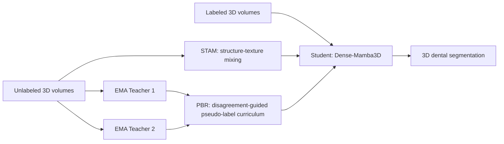

# STP-Net

Official implementation for:

**Balancing Integrity and Separation: A Curriculum-Driven Dual-Teacher Framework for 3D Dental Segmentation**

STP-Net is a semi-supervised framework for sparse-label 3D dental segmentation. It targets a key difficulty in dental segmentation: the model must preserve complete tooth morphology, especially roots and low-contrast regions, while also separating adjacent teeth with narrow interdental gaps.

The framework combines **Structure-Texture-Aware Mixing (STAM)**, **Progressive Boundary Refinement (PBR)**, and a **Dense-Mamba3D** backbone. In early training, STP-Net favors integrity-preserving pseudo labels to avoid missing uncertain tooth structures. As teacher agreement improves, it gradually shifts toward stricter boundary separation.

## News

- Code cleanup for public GitHub release is in progress.
- Training code for CBCT-style NumPy volumes and MICCAI2022/Teeth3DS+-style mesh-derived volumes is included.

## Method Overview

STP-Net contains three main components:

- **Dense-Mamba3D Backbone**: a 3D encoder-decoder network with dense multi-scale feature propagation, Mamba-based long-range dependency modeling, Stage-3 bidirectional scanning, SE-guided skip fusion, and progressive decoding.
- **STAM: Structure-Texture-Aware Mixing**: a dual-granularity mixing strategy that combines object-level and texture-level perturbations to maintain teacher diversity without damaging plausible dental topology.
- **PBR: Progressive Boundary Refinement**: a curriculum pseudo-label fusion module that uses disagreement between two EMA teachers. High disagreement activates an integrity-preserving union policy; high agreement activates a separation-oriented intersection policy.




## Main Contributions

- We propose **STP-Net**, a curriculum-driven dual-teacher semi-supervised framework for sparse-label 3D dental segmentation.
- We design **Dense-Mamba3D** to combine local interdental boundary cues with long-range tooth-root morphology.
- We introduce **STAM** to generate anatomically plausible structure-texture perturbations and reduce teacher coupling.
- We introduce **PBR** to balance early-stage morphological integrity and late-stage boundary separation.
- We validate the method on public CBCT and Teeth3DS+ benchmarks under limited-label settings.

## Results

### 3D CBCT Dataset

| Setting    | Method  | DSC(%)↑ | IoU(%)↑ | ASD(mm)↓ | HD95(mm)↓ | FLOPs(G)↓ | Params(M)↓ |
| :--------- | :------ | :-----: | :-----: | :------: | :-------: | :-------: | :--------: |
| 10% labels | STP-Net |  92.54  |  86.96  |   0.48   |   2.96    |   58.43   |   11.10    |
| 20% labels | STP-Net |  93.01  |  87.73  |   0.41   |   0.61    |   58.43   |   11.10    |

### Teeth3DS+ Dataset

| Setting    | Method  | DSC(%)↑ | IoU(%)↑ | ASD(mm)↓ | HD95(mm)↓ | FLOPs(G)↓ | Params(M)↓ |
| :--------- | :------ | :-----: | :-----: | :------: | :-------: | :-------: | :--------: |
| 10% labels | STP-Net |  93.31  |  87.54  |   0.28   |   1.26    |   58.43   |   11.10    |
| 20% labels | STP-Net |  93.89  |  88.60  |   0.27   |   1.20    |   58.43   |   11.10    |

## Repository Structure

```text
STP-Net/
├── teeth/
│   ├── train_teeth.py          # Main training script for CBCT-style dental volumes
│   ├── dataloaders.py          # NumPy dataset and 3D augmentation
│   ├── losses.py               # Dice, CE, CutMix, and foreground-focused losses
│   ├── teeth_utils.py          # EMA, logging, masks, checkpoints
│   ├── test_util.py            # Sliding-window 3D evaluation
│   ├── statistic.py            # Training metrics
│   ├── Vnet.py                 # VNet backbone
│   ├── TMamba3D.py             # TMamba3D-compatible backbone file
│   └── Dense_Mamba3D.py        # Dense-Mamba3D backbone for STP-Net
├── MICCAI2022/
│   ├── train_miccai.py         # Training script for voxelized Teeth3DS+/MICCAI2022 data
│   ├── mesh_voxelizer.py       # OBJ/JSON mesh-to-volume preprocessing
│   ├── dataset_utils.py        # Dataset utilities
│   └── process.py              # Additional preprocessing helpers
├── code/
│   └── utils/
│       └── ramps.py            # Consistency ramp-up schedule
├── requirements.txt
└── README.md
```

## Installation

```bash
git clone https://github.com/itsxzy/STP-Net.git
cd STP-Net

conda create -n stpnet python=3.10 -y
conda activate stpnet

pip install -r requirements.txt
```

If you use a Mamba-based backbone, install a `mamba-ssm` version compatible with your CUDA and PyTorch environment. Installation may vary across systems.

## Data Preparation

### CBCT-Style NumPy Volumes

The dental volume pipeline expects preprocessed NumPy files:

```text
tooth_dataset/
├── Tmamba_processed_npy/
│   ├── case001_image.npy
│   ├── case001_label.npy
│   ├── case002_image.npy
│   └── case002_label.npy
└── Tmamba_lists2/
    ├── 10percent/
    │   ├── train_lab.txt
    │   ├── train_unlab.txt
    │   └── test.txt
    └── 20percent/
        ├── train_lab.txt
        ├── train_unlab.txt
        └── test.txt
```

Each line in a split file should contain a case ID without suffix:

```text
case001
case002
case003
```

The loader will search for:

```text
case001_image.npy
case001_label.npy
```

### Teeth3DS+ / MICCAI2022 Mesh Data

For mesh data stored as OBJ/JSON, convert the surface mesh and vertex labels into voxel volumes:

```bash
cd MICCAI2022
python mesh_voxelizer.py <OBJ_JSON_DATA_DIR> <NPY_OUTPUT_DIR> 0.5 binary
```

Expected output:

```text
miccai_npy/
├── patient001_upper_image.npy
├── patient001_upper_label.npy
├── patient001_lower_image.npy
└── patient001_lower_label.npy
```

Prepare split files:

```text
miccai_lists/
  ├── 10percent/
  │   ├── train_lab.txt
  │   ├── train_unlab.txt
  │   └── test.txt
  └── 20percent/
      ├── train_lab.txt
      ├── train_unlab.txt
      └── test.txt
    
```

## Training

### CBCT-Style Dental Volume Training

Before running, update paths in:

- `teeth/train_teeth.py`: `data_root`, `result_dir`
- `teeth/dataloaders.py`: `get_dataset_path()` / `base_path`

Run:

```bash
cd teeth
python train_teeth.py
```

Key options in `teeth/train_teeth.py`:

```python
batch_size = 8
lr = 5e-4
pretraining_epochs = 300
self_training_epochs = 500
label_percent = 15
model_type = 'tmamba'  # 'vnet' or 'tmamba'
```

### Teeth3DS+ / MICCAI2022 Training

Before running, update paths in:

- `MICCAI2022/train_miccai.py`: `DATA_ROOT`, `LISTS_DIR`, `RESULT_DIR`

Run:

```bash
cd MICCAI2022
python train_miccai.py
```

Key options in `MICCAI2022/train_miccai.py`:

```python
LABEL_MODE = 'multiclass'  # 'binary' or 'multiclass'
NUM_CLASSES = 2 if LABEL_MODE == 'binary' else 33
PATCH_SIZE = (32, 96, 96)
MODEL_TYPE = 'tmamba'      # 'vnet' or 'tmamba'
```

## Evaluation

The training scripts include sliding-window validation. For the CBCT-style dental volume pipeline, use `test_model()` in `teeth/train_teeth.py` to load a checkpoint and optionally save predictions:

```python
avg_metric, m_list = test_model(net, test_loader, save_predictions=True)
```

Reported metrics include:

- Dice Similarity Coefficient (DSC)
- Intersection over Union (IoU)
- Average Surface Distance (ASD)
- 95th percentile Hausdorff Distance (HD95)
- mean IoU and accuracy in the provided test utilities

## Checkpoints and Outputs

Training outputs are written to directories such as:

```text
train_result/
result/
predictions*/
```

These are excluded from Git by default. Please do not upload private clinical data, processed patient volumes, checkpoints, or TensorBoard logs directly to the repository.

## Reproducibility Notes

- Keep training and inference patch sizes consistent.
- For Mamba-based models, the configured input size must match the crop size.
- Set random seeds with `seed_reproducer(...)`.
- For sparse foreground CBCT settings, foreground-focused loss options are available in `teeth/losses.py`.
- For public release, prefer replacing hard-coded absolute paths with command-line arguments or configuration files.

## Citation

If this repository is useful for your research, please cite:

```bibtex
@article{stpnet2026,
  title={Balancing Integrity and Separation: A Curriculum-Driven Dual-Teacher Framework for 3D Dental Segmentation},
  author={Anonymous Authors},
  journal={Under review},
  year={2026}
}
```

## Acknowledgements

This repository builds on ideas from semi-supervised medical image segmentation, teacher-student learning, copy-paste augmentation, and Mamba-based visual modeling. We thank the authors of BCP/DCP-style frameworks and related open-source dental segmentation projects.

## Contact

For questions, please open an issue or contact the repository maintainer.
